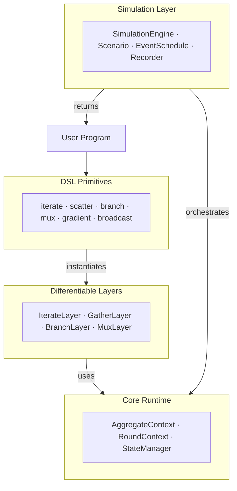

# DifField

**Differentiable Field Calculus for Graph-Based Learning and Simulation**

DifField is a PyTorch-based framework that brings **aggregate computing** and **field calculus** to differentiable programming. It lets you write spatial programs using high-level field operations — `iterate`, `scatter`, `branch`, `gradient` — that compile to message-passing on graphs and support end-to-end gradient-based learning.


<div align="center" width="100%">
    <table><tr>
        <td align="center"><br/><sub><b>Boids Flocking</b> — learned emergent behavior</sub></td>
        <td align="center"><br/><sub><b>Spatial Channel</b> — routing around obstacles</sub></td>
        <td align="center"><br/><sub><b>Large-Scale Gradient</b> — 250K nodes diffusion</sub></td>
    </tr></table>
</div>

---

## Install

Requires [uv](https://github.com/astral-sh/uv). Pick the extra that matches your hardware:

```bash
# CPU
uv sync --extra cpu

# NVIDIA GPU (CUDA)
uv sync --extra cuda

# AMD GPU (ROCm) — build from source
bash install-rocm-7.2.sh
```

Add `--extra decentralized` to any of these to enable
[decentralized execution](#decentralized-execution), and `--extra vmas` for the
[VMAS experiments](#vmas-experiments):

```bash
uv sync --extra cpu --extra decentralized --extra vmas
```

---

## Quick Start

Build a distance field from a source node on a 10×10 grid:

```python
from diffield import GridScenario, SimulationEngine, iterate, scatter, mux, gather_min
from diffield.dsl import field

scenario = GridScenario(10, 10, connectivity=4)
engine = SimulationEngine.from_scenario(scenario)
source = scenario.marker(0, 0)  # source at top-left

def program(runtime):
    src = runtime.signals["source"]
    return iterate(
        field.inf(),
        lambda d: mux(src, field.of(0.0), gather_min(scatter(d + 1.0))),
        name="dist",
    )

output, runtime = engine.run(rounds=40, program=program, signals={"source": source})
```

The program converges to a **hop-distance field** — every node holds its minimum distance from the source.

---

## Architecture

DifField is organized in five conceptual layers:



Each layer builds on the one below it. The **Core Runtime** manages graph topology and per-node state; **Layers** wrap operations as differentiable `nn.Module`s; **DSL Primitives** provide the user-facing API; and the **Simulation Layer** orchestrates multi-round executions with events, dynamic topologies, and recording.

---

## DSL Primitives

The DSL provides composable field operators that run on every node of the graph simultaneously.

### Core Operators

| Primitive | Description |
|-----------|-------------|
| `iterate(init, fn, name=...)` | Per-node recurrent state — evolves over rounds |
| `scatter(value)` | Build edge-wise neighbor messages from a node field |
| `gather(expr, aggr)` | Aggregate a `LinkField` into a node field |
| `branch(cond, if_true, if_false)` | Domain restriction with communication isolation |
| `mux(cond, if_true, if_false)` | Pointwise conditional selection (no topology change) |

### Building Blocks

| Primitive | Description |
|-----------|-------------|
| `gradient(source, weight=None)` | Minimum-cost distance field from source nodes |
| `gradient_cast(source, center, accumulation, weight=None)` | Propagate payloads along gradient paths |
| `broadcast(mask, value, weight=None)` | Spread a value from root nodes through the network |
| `collect_cast(potential, local, null, accumulation, weight=None)` | Collect payloads toward potential minima |
| `elect(key, eligible=None, grain=inf, weight=None)` | Leader election (S block) — returns `(leader_mask, adopted_key)` |
| `descend(potential, toward, tau=None)` | Soft steepest-descent direction on a potential field |
| `nbr_count()` / `has_neighbors()` | Neighbour degree as a float field / as a boolean field |

### Field Helpers

```python
from diffield.dsl import field

field.of(0.0)     # constant field
field.zeros()     # zero field
field.ones()      # one field
field.inf()       # infinity field
```

`Field` inputs are always explicit tensors, typically built with `field.of(...)`, `field.zeros()`, `field.inf()`, or scenario helpers. Neighborhood aggregation always works on `LinkField`, so write `gather_min(scatter(x))`, `gather_sum(scatter(x) * w)`, or `gather(scatter(x) + scatter_range(), aggr="min")`.

---

## Simulation Layer

The simulation layer provides reusable components for running aggregate programs over multiple rounds.

### Components

- **`Scenario`** — defines graph topology and helper builders (`GridScenario`, `SpatialScenario`, `FullyConnectedScenario`, `RelaxedRadiusScenario`)
- **`SimulationEngine`** — steps aggregate programs round by round
- **`EventSchedule`** + **`ScheduledEvent`** — deterministic round-based dynamic updates
- **`SnapshotRecorder`** — structured capture of fields, exports, and outputs

### Example: Dynamic Simulation with Events

```python
from diffield import (
    GridScenario, SimulationEngine, EventSchedule, ScheduledEvent,
    SnapshotRecorder, iterate, scatter, mux, gather_min,
)
from diffield.dsl import field

scenario = GridScenario(10, 10, connectivity=4)
engine = SimulationEngine.from_scenario(scenario)

source = scenario.marker(0, 0)

def move_source(runtime):
    runtime.signals["source"] = scenario.marker(9, 9)

schedule = EventSchedule([
    ScheduledEvent(round_idx=20, callback=move_source, name="move"),
])

recorder = SnapshotRecorder(state_fields=["dist"], capture_output=True, record_rounds={0, 20, 39})

def program(runtime):
    src = runtime.signals["source"]
    return iterate(
        field.inf(),
        lambda d: mux(src, field.of(0.0), gather_min(scatter(d + 1.0))),
        name="dist",
    )

output, runtime = engine.run(
    rounds=40,
    program=program,
    signals={"source": source},
    schedule=schedule,
    recorder=recorder,
)
```

---

## Decentralized Execution

The simulation layer evaluates a round as one batched operation over the whole graph.
The same program can also be run **the way the model says it should be executable** —
one device at a time, each seeing only its neighbours' messages — inside
[Mesa](https://mesa.readthedocs.io), a general-purpose agent-based modelling framework
that knows nothing about field calculus.

```bash
uv sync --extra cpu --extra decentralized
```

```python
from diffield.decentralized import run_decentralized

# Everything the program needs comes from `runtime.signals`: centrally those are
# global [N] fields, on a device they are that device's local [1 + k] view.
def program(runtime):
    return gradient(runtime.signals["source"], name="dist")

central, _ = engine.run(rounds=20, program=program, signals=signals)
local = run_decentralized(scenario=scenario, program=program, signals=signals, rounds=20)

assert torch.equal(central, local.final)
```

A device's outbound message is its `iterate` state table keyed by **alignment path**, and
its neighbours' sensor readings travel with it — `branch` keeps a link only when both of
its endpoints are in the partition, so a device cannot mask its own in-edges without them.

`mode="sync"` (default) puts a barrier between rounds, which is Gauss–Jacobi and therefore
reproduces the batched run node for node. `mode="async"` drops the barrier: devices are
shuffled, publish as they go, and may skip rounds with probability `1 - activation_prob`.

### Running the comparison

`examples/decentralized/channel_obstacles.py` runs the channel-with-obstacles program
both ways in a single invocation — centrally through `SimulationEngine`, then device by
device through Mesa — and diffs them round by round.

```bash
# synchronous: expect 0 mismatched nodes on every round
uv run --extra cpu --extra decentralized \
    python examples/decentralized/channel_obstacles.py --rows 12 --cols 12 --rounds 40

# asynchronous: expect a divergent transient, identical fixed point
uv run --extra cpu --extra decentralized \
    python examples/decentralized/channel_obstacles.py --rows 12 --cols 12 --rounds 40 --async
```

Figures land in `generated/decentralized_channel_*.png`: centralized field, decentralized
field, and their difference, plus a convergence curve in async mode. Useful flags:
`--tolerance` (channel width), `--activation-prob` (async duty cycle), `--seed`, `--no-viz`.

```bash
uv run --extra cpu --extra decentralized pytest tests/decentralized -v
```

### Moving devices

Devices may move. Pass the same `EventSchedule` both runs take; when a callback moves the
nodes, each affected device's star graph is rebuilt at its new degree and carries its own
state across, so the two runs still agree node for node while links form and break.

```python
def drift(runtime):
    runtime.scenario.step_positions(runtime.metadata["velocities"])

schedule = EventSchedule([ScheduledEvent(round_idx=i, callback=drift) for i in range(rounds)])

engine.run(rounds=rounds, program=program, signals=signals,
           metadata={"velocities": velocities}, schedule=schedule)
run_decentralized(scenario=scenario, program=program, signals=signals, rounds=rounds,
                  metadata={"velocities": velocities}, schedule=schedule)
```

`result.retopologized_rounds` lists the rounds in which some device's neighbour set changed.
Let the devices slow to a halt and the field re-converges on the true shortest-path metric
of wherever they ended up — `tests/decentralized/test_moving_devices.py` checks that against
a NetworkX Dijkstra.

`examples/decentralized/moving_devices.py` animates it: devices drift at full speed, then
slow to a halt, while the field they are computing keeps up.

```bash
uv run --extra cpu --extra decentralized \
    python examples/decentralized/moving_devices.py                  # GIF
uv run --extra cpu --extra decentralized \
    python examples/decentralized/moving_devices.py --format mp4     # needs ffmpeg
uv run --extra cpu --extra decentralized \
    python examples/decentralized/moving_devices.py --async --rounds 160
```

The left panel is the live network, nodes coloured by their distance to the source and links
redrawn every round; the right panel tracks the mean distance for both executions against the
true metric of the final layout. The run reports how many rounds rewired someone's
neighbourhood, when the devices parked, and how far the field ended from that true metric.

Two honest caveats it will tell you about. Re-convergence after a link breaks is slow — a
distance has to *grow*, and a min-based gradient raises it a step at a time rather than a hop
per round, so give it rounds after the devices park. And a group of devices cut off from the
source entirely will sit on stale finite estimates that climb very slowly rather than jumping
to infinity: that is count-to-infinity, a property of the program and not of decentralization,
which is why both executions do it identically.

**Limits.** Reproducible only for programs whose every `gather` scatters a sensor, a
constant, or a previous-round `iterate` state — the condition documented on `DeviceContext`.
It holds for `gradient`, `gradient_cast`, `broadcast` and `collect_cast`, hence for the
channel. `branch` conditions must likewise be sensors or previous-round state.

---

## VMAS Experiments

`examples/vmas_diffield/` trains differentiable field-calculus controllers inside
[VMAS](https://github.com/proroklab/VectorizedMultiAgentSimulator), comparing a
hand-tuned aggregate program against a learned-θ version of the same program, a
GNN-gated hybrid, and a pure GNN — under SHAC (analytic-gradient policy learning)
and behaviour cloning. Five scenarios: `flocking`, `flocking_beacon`, `navigation`,
`discovery`, `sampling`.

Requires the `vmas` extra:

```bash
uv sync --extra cpu --extra vmas
```

The programs in `examples/vmas_diffield/programs.py` are written entirely in the DSL —
`elect` picks a flock leader, `descend` reads out a steering direction from a `gradient`
field, and `collect_cast`/`broadcast` run the discovery recruit quota. Agents move each
physics step, so the rollout calls `AggregateContext.update_topology(edge_index,
positions=pos)` to swap the graph in place while the recurrent field state persists and
self-heals.

```bash
# one scenario, quick pass
uv run --extra cpu --extra vmas python examples/vmas_diffield/main.py \
    --mode shac --scenarios flocking_beacon --updates 20 --seeds 0 --num-envs 32

# behaviour cloning instead
uv run --extra cpu --extra vmas python examples/vmas_diffield/main.py \
    --mode imitation --scenarios flocking,navigation

# cross-scenario figures and master CSV
uv run --extra cpu --extra vmas python examples/vmas_diffield/summarize.py

# the whole suite (~6-7 h; `--pilot` for a ~15 min sanity pass)
bash examples/vmas_diffield/run_all.sh --pilot
```

Artifacts land under `generated/vmas-<scenario>-{shac,imitation}/` and
`generated/vmas-comparison/`. Training is checkpointed per `(policy, seed)`, so a
re-run resumes rather than restarting.

---

## Spatial Neighborhood Range

For spatial scenarios, `edge_weight` can represent the geometric distance between neighbouring devices. Use `edge_weight_mode="distance"` when building a `SpatialScenario` to carry Euclidean edge lengths instead of unit hop weights.

```python
from diffield import SpatialScenario, gradient

scenario = SpatialScenario(positions=positions, edge_radius=0.2, edge_weight_mode="distance")

# Uses geometric edge distances by default
dist = gradient(source, name="dist")
```

The convenience operator `gradient(source)` uses the range sensor by default, keeping hop-based programs explicit while allowing geometric graphs to use distances coherent with node positions.

When you provide a custom edge cost to `gradient`, `gradient_cast`, `broadcast`, or `collect_cast`, pass it as a neighborhood expression such as `scatter(weight_field)` or `scatter_range()`.

---

## Testing

```bash
uv run pytest
```

---

## Further Reading

- [Architecture & Design](docs/architecture.md) — UML diagrams and conceptual model
