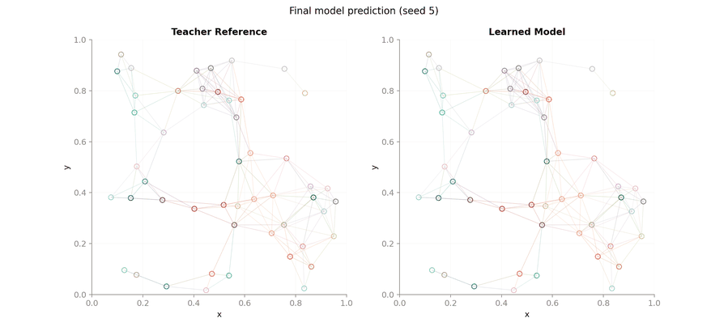
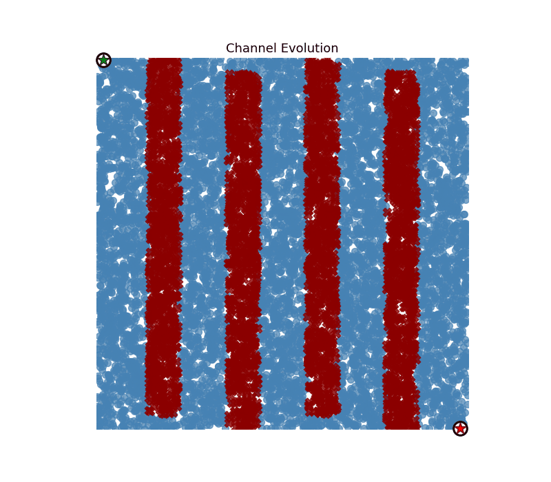
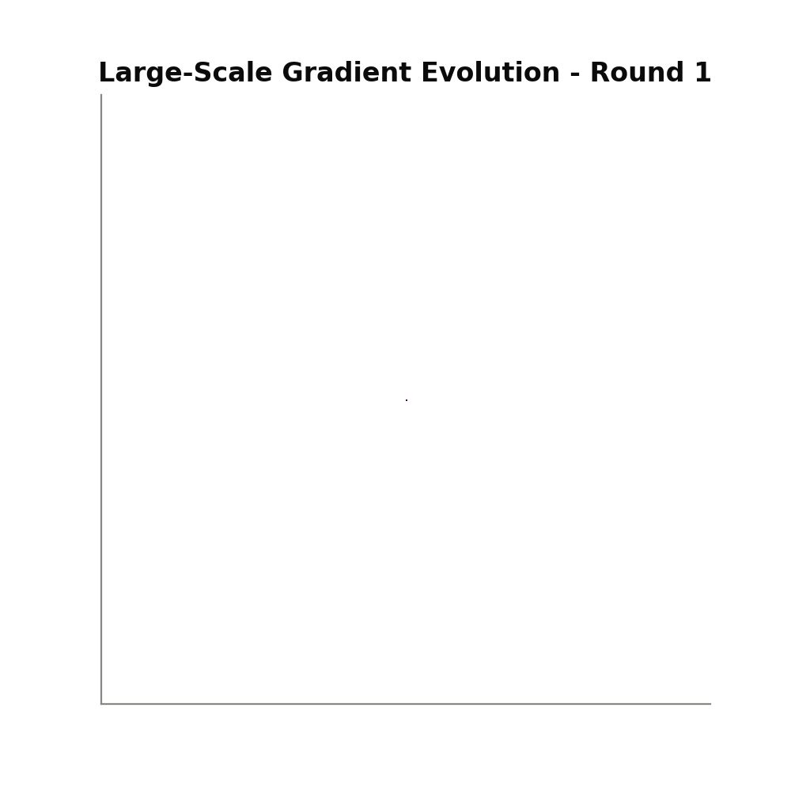
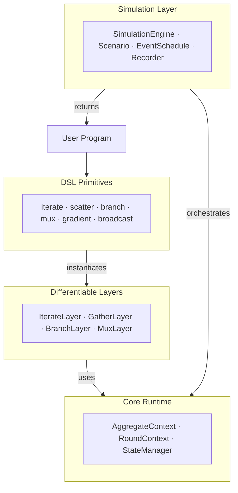

<div align="center">
    
    <h1>DifField</h1>
    <p><em>Differentiable Field Programming for Self-Organizing Systems</em></p>
</div>

DifField is a PyTorch-based framework that brings **field programming** to the realm of differentiable programming.
It lets you write spatial programs using high-level and composable operations — `iterate`, `scatter`, `gather` — that compile to message-passing on graphs and support end-to-end gradient-based learning.

<div align="center">
    <table><tr>
        <td align="center"><br/><sub><b>Boids Flocking</b> — learned emergent behavior</sub></td>
        <td align="center"><br/><sub><b>Spatial Channel</b> — routing around obstacles</sub></td>
        <td align="center"><br/><sub><b>Large-Scale Gradient</b> — 250K nodes diffusion</sub></td>
    </tr></table>
</div>

---

## Install

Requires [uv](https://github.com/astral-sh/uv). 
Pick the extra that matches your hardware:

```bash
# CPU
uv sync --extras "cpu"

# NVIDIA GPU (CUDA)
uv sync --extras "cuda"
```

---

## Quick Start

DifField programs operate on **fields** — tensors that live on the nodes of a graph and evolve over time.
A program is any function that takes a `Runtime` and returns an output field.

One of the simplest programs you can express via field programming is the computation of a distance field from a source node (also known as a gradient distance field).

This can be expressed in DifField as a program that iteratively updates a distance field `d` by taking the minimum of its neighbors' values plus the edge cost, while resetting to zero at the source:
```python
import diffield
from diffield.dsl import iterate, field, gather_min, scatter_range, scatter, mux

def program(runtime):
    src = runtime.signals["source"]
    return iterate(
        field.inf(),
        lambda d: mux(src, field.of(0.0), gather_min(scatter(d) + scatter_range())),
        name="dist",
    )
```
Looking at this program, you can see the core DSL primitives in action:
- `iterate` creates a recurrent state `d` that evolves over rounds, starting from `field.inf()` (i.e., all nodes are infinitely far from the source).
- `scatter(d + scatter_range())` builds edge-wise messages that represent the distance to neighbors plus the edge cost (which is 1.0 for unweighted graphs).
- `gather_min(...)` aggregates these messages by taking the minimum, giving each node its best guess of the distance to the source based on its neighbors.
- `mux(src, field.of(0.0), ...)` resets the distance to zero at the source node(s) where `src` is true.

Additionally, `runtime.signals` lets you inject dynamic inputs (like the source marker) that can change over time or be influenced by events.

This program requires a `Runtime` to execute, which is provided by the `SimulationEngine`:

```python
scenario = GridScenario(10, 10, connectivity=4)
engine = SimulationEngine.from_scenario(scenario)
source = scenario.marker(0, 0)
output, runtime = engine.run(
    rounds=20,
    program=program,
    signals={"source": source},
)
print("---Output field---")
print(output.cpu().numpy())
```

This sets up a 10×10 grid scenario, initializes the simulation engine, and runs the program for 20 rounds with the source node at (0, 0). The final distance field is returned as `output`,
and the full runtime state is available in `runtime` for inspection or recording.

This example can be found in `examples/example_readme.py` and can be run with:

```bash
uv run python examples/example_readme.py
``` 
If everything is set up correctly, you should see a printed output field that represents the distance from the source node across the grid:
```
---Output field---
[ 0.  1.  2.  3.  4.  5.  6.  7.  8.  9.  1.  2.  3.  4.  5.  6.  7.  8.
  9. 10.  2.  3.  4.  5.  6.  7.  8.  9. 10. 11.  3.  4.  5.  6.  7.  8.
  9. 10. 11. 12.  4.  5.  6.  7.  8.  9. 10. 11. 12. 13.  5.  6.  7.  8.
  9. 10. 11. 12. 13. 14.  6.  7.  8.  9. 10. 11. 12. 13. 14. 15.  7.  8.
  9. 10. 11. 12. 13. 14. 15. 16.  8.  9. 10. 11. 12. 13. 14. 15. 16. 17.
  9. 10. 11. 12. 13. 14. 15. 16. 17. 18.]
```
---

## Architecture

DifField is organized in five conceptual layers:



Each layer builds on the one below it. 
The **Core Runtime** manages graph topology and per-node state; 
**Layers** wrap operations as differentiable `nn.Module`s (torch); 
**DSL Primitives** provide the user-facing API for writing field programs; 
and the **Simulation Layer** orchestrates multi-round executions with events (aka sensor fields), 
dynamic topologies, and recording.

---

## DSL Primitives

The DSL provides composable field operators that run on every node of the graph simultaneously.

### Core Operators

| Primitive | Description |
|-----------|-------------|
| `iterate(init, fn, name=...)` | Per-node recurrent state — evolves over rounds |
| `scatter(value)` | Build edge-wise neighbor messages from a node field |
| `gather(expr, aggr)` | Aggregate a `LinkField` into a node field |
| `branch(cond, if_true, if_false)` | Domain restriction with communication isolation |
| `mux(cond, if_true, if_false)` | Pointwise conditional selection (no topology change) |


### Field Helpers

```python
from diffield.dsl import field

field.of(0.0)     # constant field
field.zeros()     # zero field
field.ones()      # one field
field.inf()       # infinity field
```

Field inputs are always explicit tensors, 
typically constructed with `field.of(...)`, `field.zeros()`, `field.inf()`, 
or scenario helpers (e.g., for signals or markers).
Neighborhood aggregation operates on `LinkField`, so write `gather_min(scatter(x))`, `gather_sum(scatter(x) * w)`, or `gather(scatter(x) + scatter_range(), aggr="min")`.

## Examples

The `examples/` directory contains self-contained programs demonstrating both pure aggregate workflows and differentiable learning pipelines.

| Example | Description |
|---------|-------------|
| **Gradients** | Self-healing distance fields on static and dynamic topologies. Includes learnable hop-cost parameters, attention-based aggregation, and moving-node scenarios |
| **Boids** | Flocking control via aggregate programming. Learn separation, alignment, and cohesion weights through imitation learning |
| **Channel** | Shortest-path routing around obstacles using composite distance fields, with scaling benchmarks |
| **Collects** | Gradient-cast payload collection on various topologies (grid, k-NN, fully connected) |
| **Tensor Encoding** | Replicates the paper's four-stage computational cycle with a dense tensor comparison |

Each learning-based example follows a clean structure: `domain/` for pure aggregate programs, `model/` for PyTorch modules, and `training/` for optimization loops. Results (GIFs, plots, checkpoints) are saved in `generated/`.

See `examples/README.md` for detailed usage and commands.

---

## Further Reading

- [Architecture & Design](docs/architecture.md) — UML diagrams and conceptual model
