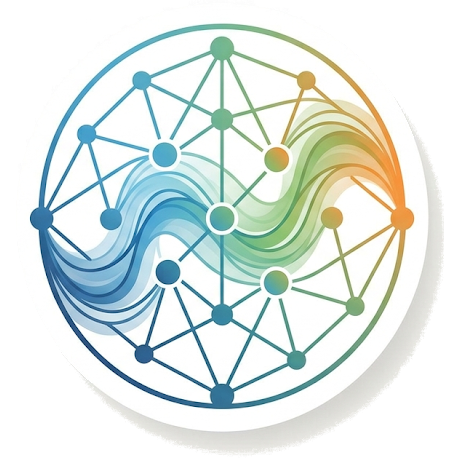
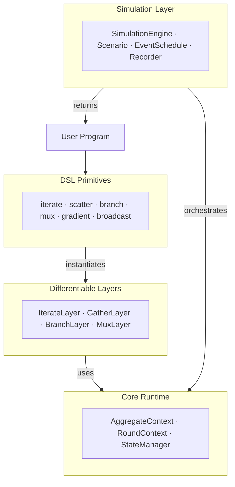

# DifField

**Differentiable Field Calculus for Graph-Based Learning and Simulation**

DifField is a PyTorch-based framework that brings **aggregate computing** and **field calculus** to differentiable programming. It lets you write spatial programs using high-level field operations — `iterate`, `scatter`, `branch`, `gradient` — that compile to message-passing on graphs and support end-to-end gradient-based learning.



---

## Install

Requires [uv](https://github.com/astral-sh/uv). Pick the extra that matches your hardware:

```bash
# CPU
uv sync --extras "cpu"

# NVIDIA GPU (CUDA)
uv sync --extras "cuda"

# AMD GPU (ROCm) — build from source
bash install-rocm-7.2.sh
```

---

## Quick Start

Build a distance field from a source node on a 10×10 grid:

```python
from diffield import GridScenario, SimulationEngine, iterate, scatter, mux, gather_min
from diffield.dsl import field

scenario = GridScenario(10, 10, connectivity=4)
engine = SimulationEngine.from_scenario(scenario)
source = scenario.marker(0, 0)  # source at top-left

def program(runtime):
    src = runtime.signals["source"]
    return iterate(
        field.inf(),
        lambda d: mux(src, field.of(0.0), gather_min(scatter(d + 1.0))),
        name="dist",
    )

output, runtime = engine.run(rounds=40, program=program, signals={"source": source})
```

The program converges to a **hop-distance field** — every node holds its minimum distance from the source.

---

## Architecture

DifField is organized in five conceptual layers:



Each layer builds on the one below it. The **Core Runtime** manages graph topology and per-node state; **Layers** wrap operations as differentiable `nn.Module`s; **DSL Primitives** provide the user-facing API; and the **Simulation Layer** orchestrates multi-round executions with events, dynamic topologies, and recording.

---

## DSL Primitives

The DSL provides composable field operators that run on every node of the graph simultaneously.

### Core Operators

| Primitive | Description |
|-----------|-------------|
| `iterate(init, fn, name=...)` | Per-node recurrent state — evolves over rounds |
| `scatter(value)` | Build edge-wise neighbor messages from a node field |
| `gather(expr, aggr)` | Aggregate a `LinkField` into a node field |
| `branch(cond, if_true, if_false)` | Domain restriction with communication isolation |
| `mux(cond, if_true, if_false)` | Pointwise conditional selection (no topology change) |

### Building Blocks

| Primitive | Description |
|-----------|-------------|
| `gradient(source, weight=None)` | Minimum-cost distance field from source nodes |
| `gradient_cast(source, center, accumulation, weight=None)` | Propagate payloads along gradient paths |
| `broadcast(mask, value, weight=None)` | Spread a value from root nodes through the network |
| `collect_cast(potential, local, null, accumulation, weight=None)` | Collect payloads toward potential minima |

### Field Helpers

```python
from diffield.dsl import field

field.of(0.0)     # constant field
field.zeros()     # zero field
field.ones()      # one field
field.inf()       # infinity field
```

`Field` inputs are always explicit tensors, typically built with `field.of(...)`, `field.zeros()`, `field.inf()`, or scenario helpers. Neighborhood aggregation always works on `LinkField`, so write `gather_min(scatter(x))`, `gather_sum(scatter(x) * w)`, or `gather(scatter(x) + scatter_range(), aggr="min")`.

---

## Simulation Layer

The simulation layer provides reusable components for running aggregate programs over multiple rounds.

### Components

- **`Scenario`** — defines graph topology and helper builders (`GridScenario`, `SpatialScenario`, `FullyConnectedScenario`, `RelaxedRadiusScenario`)
- **`SimulationEngine`** — steps aggregate programs round by round
- **`EventSchedule`** + **`ScheduledEvent`** — deterministic round-based dynamic updates
- **`SnapshotRecorder`** — structured capture of fields, exports, and outputs

### Example: Dynamic Simulation with Events

```python
from diffield import (
    GridScenario, SimulationEngine, EventSchedule, ScheduledEvent,
    SnapshotRecorder, iterate, scatter, mux, gather_min,
)
from diffield.dsl import field

scenario = GridScenario(10, 10, connectivity=4)
engine = SimulationEngine.from_scenario(scenario)

source = scenario.marker(0, 0)

def move_source(runtime):
    runtime.signals["source"] = scenario.marker(9, 9)

schedule = EventSchedule([
    ScheduledEvent(round_idx=20, callback=move_source, name="move"),
])

recorder = SnapshotRecorder(state_fields=["dist"], capture_output=True, record_rounds={0, 20, 39})

def program(runtime):
    src = runtime.signals["source"]
    return iterate(
        field.inf(),
        lambda d: mux(src, field.of(0.0), gather_min(scatter(d + 1.0))),
        name="dist",
    )

output, runtime = engine.run(
    rounds=40,
    program=program,
    signals={"source": source},
    schedule=schedule,
    recorder=recorder,
)
```

---

## Spatial Neighborhood Range

For spatial scenarios, `edge_weight` can represent the geometric distance between neighbouring devices. Use `edge_weight_mode="distance"` when building a `SpatialScenario` to carry Euclidean edge lengths instead of unit hop weights.

```python
from diffield import SpatialScenario, gradient

scenario = SpatialScenario(positions=positions, edge_radius=0.2, edge_weight_mode="distance")

# Uses geometric edge distances by default
dist = gradient(source, name="dist")
```

The convenience operator `gradient(source)` uses the range sensor by default, keeping hop-based programs explicit while allowing geometric graphs to use distances coherent with node positions.

When you provide a custom edge cost to `gradient`, `gradient_cast`, `broadcast`, or `collect_cast`, pass it as a neighborhood expression such as `scatter(weight_field)` or `scatter_range()`.

---

## Testing

```bash
uv run pytest
```

---

## Further Reading

- [Architecture & Design](docs/architecture.md) — UML diagrams and conceptual model
