# Architecture & Design

High-level conceptual model of DifField — focusing on **what** each component represents and **how** they compose, not on implementation details.

---

## System Overview

DifField implements a **field calculus** runtime on top of PyTorch. The core idea is that programs are written as **field operations** — computations that happen simultaneously across all nodes of a graph — and are executed through rounds of message passing.

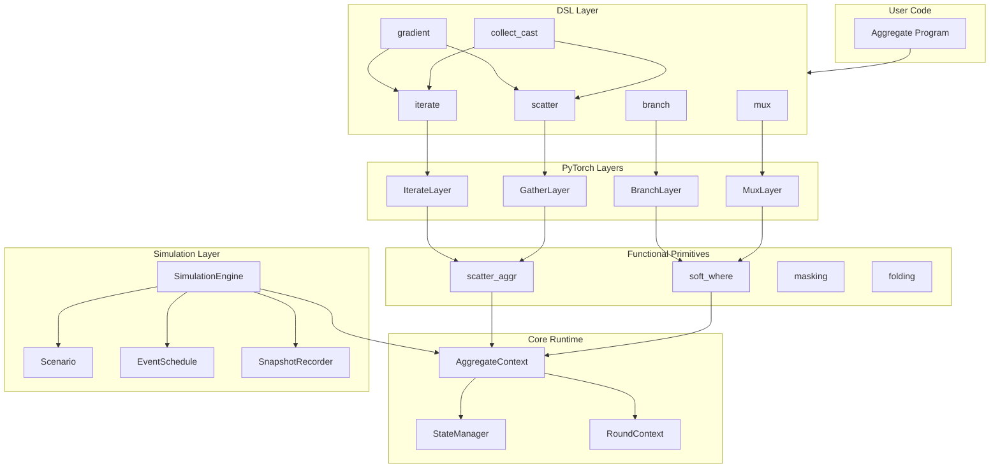

---

## Layer Architecture

### 1. Core Runtime

The foundation — manages graph topology, per-node state, and round execution.

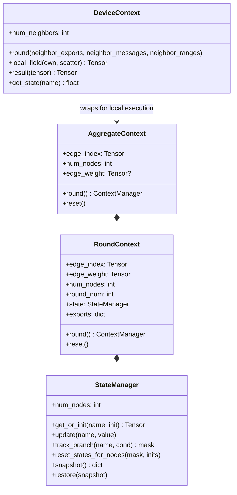

**Concepts:**

- **AggregateContext** — the global execution environment for a graph. One context per simulation.
- **RoundContext** — the per-round snapshot of topology, state, and exports. Created fresh each round.
- **StateManager** — persistent per-node memory across rounds. Handles `iterate` state, branch-switch resets, and snapshots.
- **DeviceContext** — a local view of execution from a single device's perspective, useful for debugging and didactic purposes.

### 2. Functional Utilities

Low-level differentiable building blocks — scatter operations, soft conditionals, masking, and folding.

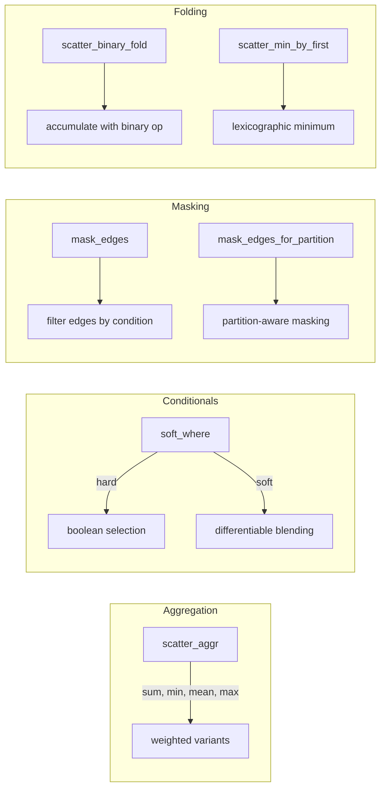

**Concepts:**

- **scatter_aggr** — differentiable neighborhood aggregation with multiple modes (hard/soft).
- **soft_where** — differentiable conditional: `soft_where(cond, a, b)` blends between `a` and `b` based on `cond`.
- **mask_edges** — filter edges based on node/edge conditions.
- **scatter_binary_fold** — fold values from neighbors using a binary accumulation function.

### 3. PyTorch Layers

`nn.Module` wrappers that make DSL primitives compatible with PyTorch's autograd and parameter management.

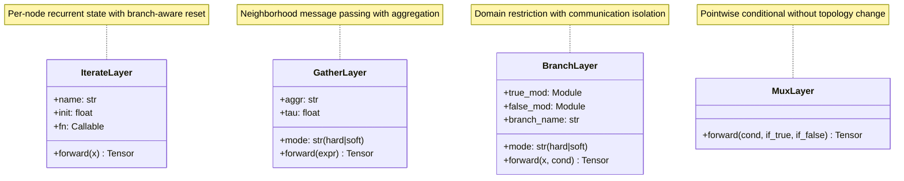

**Concepts:**

- **IterateLayer** — wraps `iterate`: manages named recurrent state, automatically resets on branch switches.
- **GatherLayer** — wraps `gather`: sends messages along edges, aggregates with configurable strategy.
- **BranchLayer** — wraps `branch`: splits execution domain, isolates communication between branches.
- **MuxLayer** — wraps `mux`: pointwise selection without affecting communication topology.

### 4. DSL Primitives

The user-facing API — composable field operators.

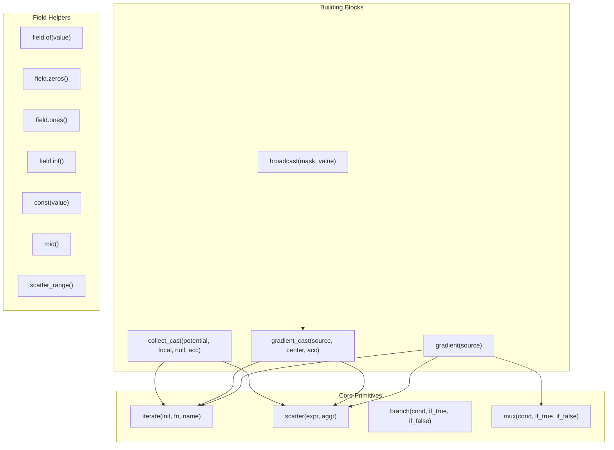

**Conceptual semantics:**

| Operator | Meaning |
|----------|---------|
| `iterate` | "Remember this value across rounds, evolving it with `fn`" |
| `scatter` | "Send this expression to neighbors and aggregate their messages" |
| `branch` | "Split the domain: nodes where `cond` is true run `if_true`, others run `if_false`, with no communication between branches" |
| `mux` | "Select between two values per-node, without changing communication" |
| `gradient` | "Compute minimum-cost distance from source nodes" |
| `gradient_cast` | "Route payloads along gradient paths toward sources" |
| `broadcast` | "Spread a value from root nodes to the rest of the network" |
| `collect_cast` | "Gather payloads from children toward local minima of a potential field" |

### 5. Simulation Layer

Orchestrates multi-round executions with topology management, events, and recording.

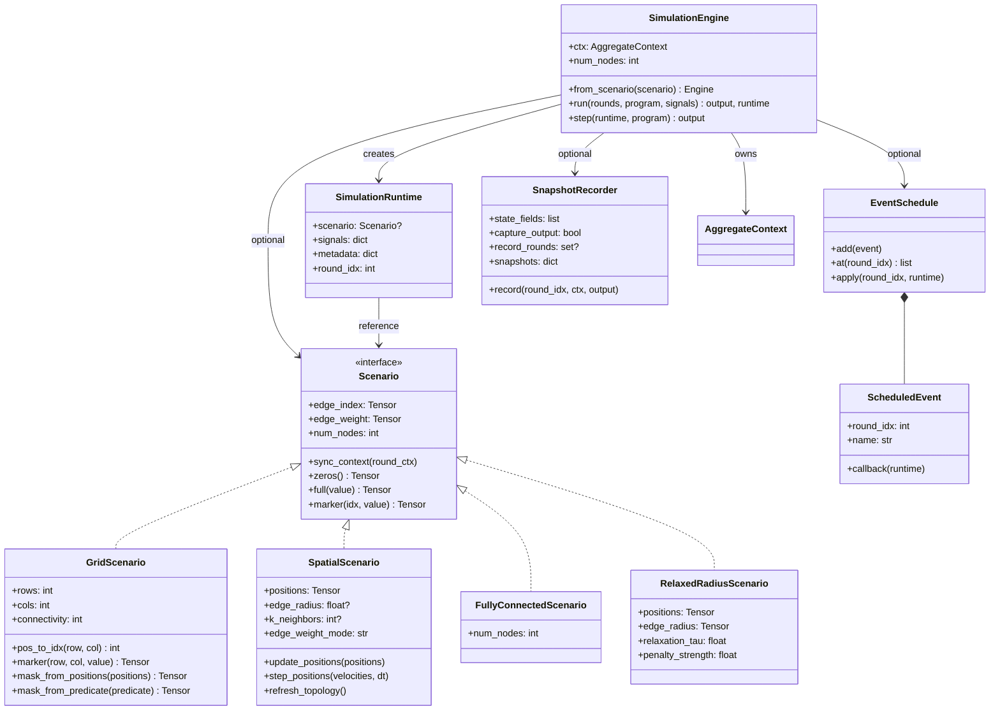

**Concepts:**

- **Scenario** — defines the graph topology (nodes, edges, weights) and provides helper methods for creating fields, markers, and masks. Different scenarios model different spatial abstractions.
- **SimulationEngine** — the main execution loop. Runs a program for N rounds, optionally applying events and recording snapshots.
- **SimulationRuntime** — mutable state shared between the engine, events, and the program. Carries signals, metadata, and the current round index.
- **EventSchedule** — a registry of callbacks triggered at specific rounds. Enables dynamic behavior (moving nodes, changing sources, topology updates).
- **SnapshotRecorder** — captures the state of fields, exports, and outputs at specified rounds for later analysis.

---

## Execution Lifecycle

How a simulation executes, round by round:

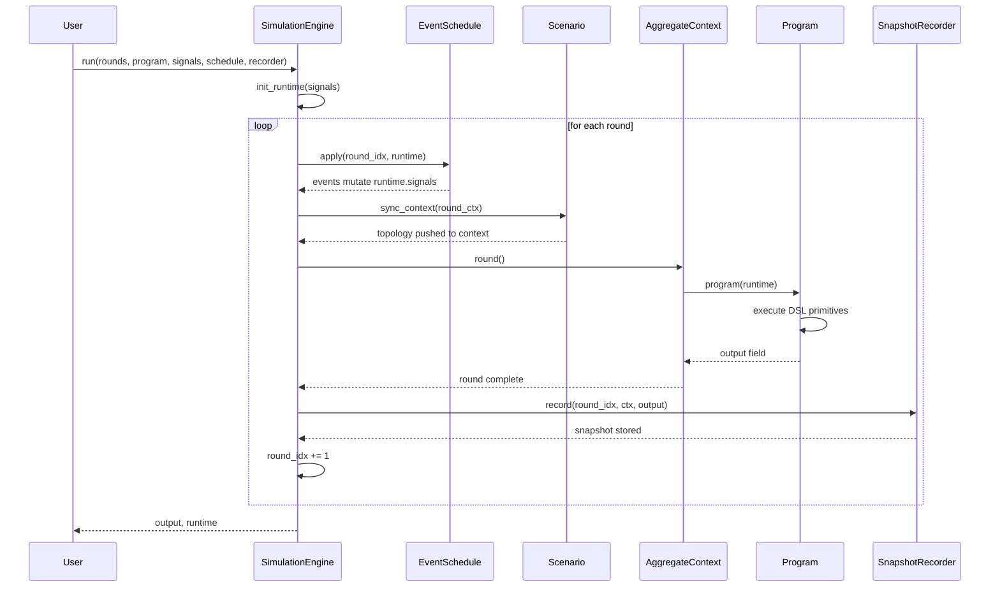

### Round Execution Detail

Within a single round, the DSL primitives compose as follows:

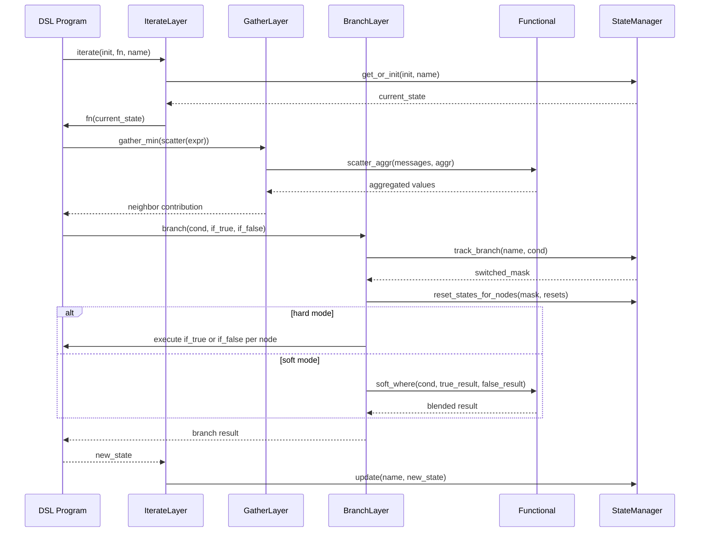

---

## Conceptual Model: Fields and Aggregate Computing

### What is a Field?

A **field** is a function from nodes to values. Every DSL expression produces a field — a tensor of shape `(num_nodes,)` or `(num_nodes, d)`.

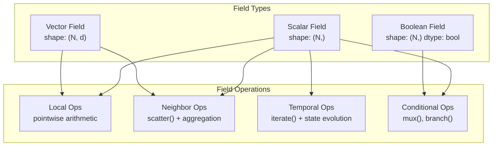

### Aggregate Computing Paradigm

DifField implements the **aggregate computing** model:

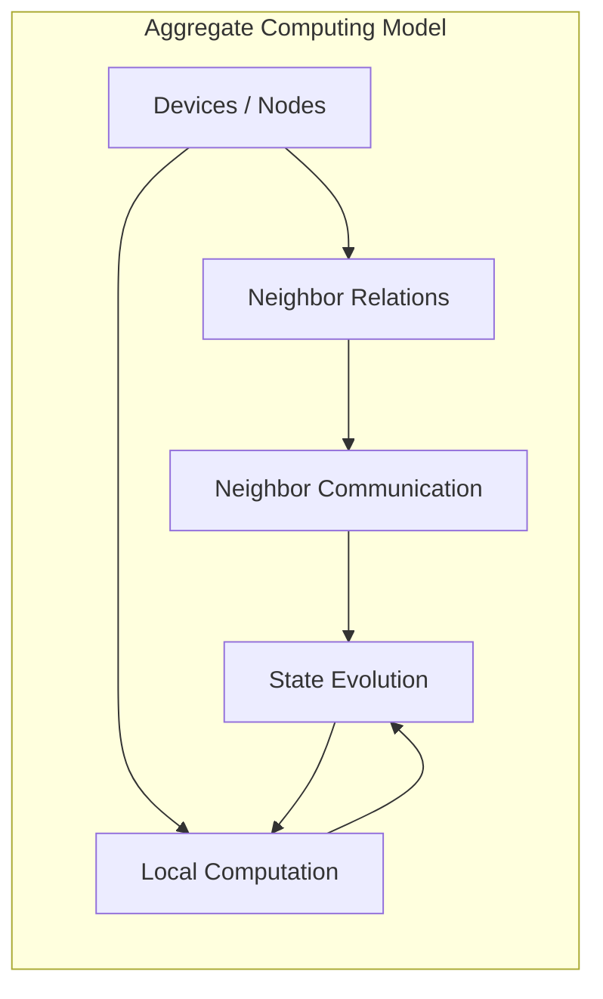

1. **Devices** are nodes in a graph
2. **Neighbor relations** define who can communicate with whom
3. **Local computation** happens independently on each device
4. **Neighbor communication** exchanges messages along edges
5. **State evolution** (`iterate`) carries information across rounds

### Hard vs Soft Semantics

Every operator supports two modes:

| Mode | Behavior | Use Case |
|------|----------|----------|
| **Hard** | Discrete selection, exact aggregation | Classical aggregate computing, exact algorithms |
| **Soft** | Differentiable blending, smooth aggregation | Gradient-based learning, optimization |

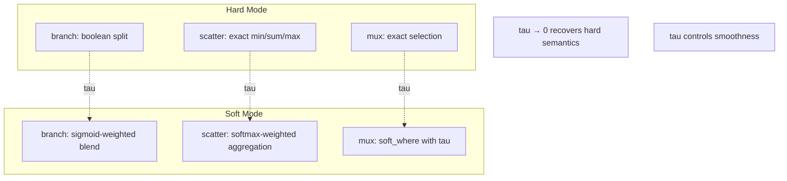

---

## Scenario Hierarchy

Scenarios model different spatial abstractions:

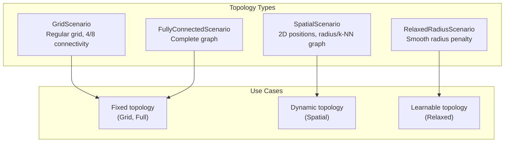

| Scenario | Topology | Dynamic | Learnable | Best For |
|----------|----------|---------|-----------|----------|
| `GridScenario` | Fixed grid | No | No | Structured spatial domains |
| `FullyConnectedScenario` | Complete graph | No | No | Small-scale, all-to-all |
| `SpatialScenario` | Radius / k-NN | Yes | No | Moving nodes, dynamic graphs |
| `RelaxedRadiusScenario` | Fully connected + penalty | Yes | Yes | Differentiable connectivity learning |

---

## DSL Composition Patterns

Complex behaviors emerge from composing primitives:

### Gradient Pattern

```
gradient(source) = iterate(field.inf(), λd. mux(source, field.of(0), gather_min(scatter(d) + step)), name="dist")
```

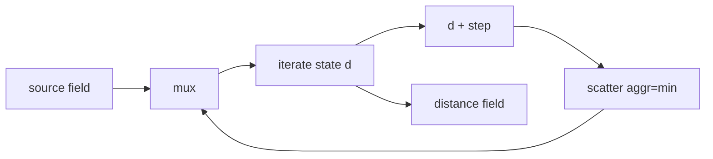

### Collect-Cast Pattern

```
collect_cast(potential, local, null, acc) = iterate("collect", local, λc. acc(local, collect_from_children(c)))
```

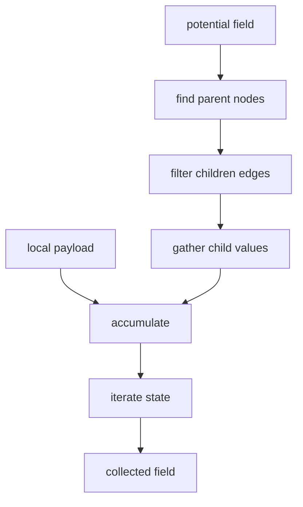

### Broadcast Pattern

```
broadcast(mask, value) = gradient_cast(source=mask, center=value, accumulation=identity)
```

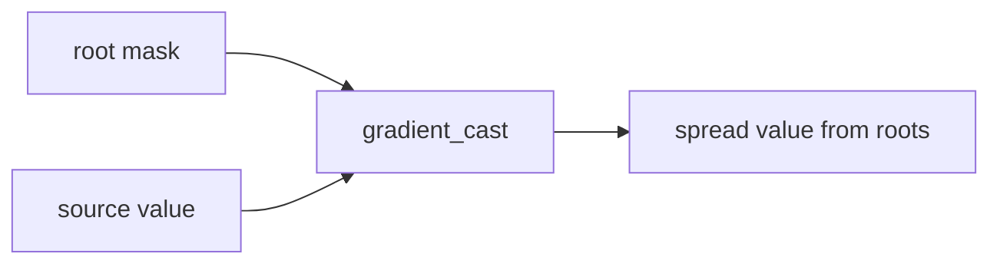

---

## Key Design Decisions

1. **PyTorch-native** — All operations are differentiable; the entire simulation can be optimized end-to-end.
2. **Hard/soft duality** — Every operator supports both discrete and smooth semantics, controlled by `mode` and `tau`.
3. **Round-based execution** — Computation happens in discrete rounds, enabling stateful programs and dynamic topology.
4. **Scenario abstraction** — Topology is decoupled from programs; the same program runs on any graph.
5. **Event-driven dynamics** — `EventSchedule` enables complex temporal behaviors without modifying the program.
6. **State isolation** — `branch` provides communication isolation between sub-domains, enabling spatial partitioning.
